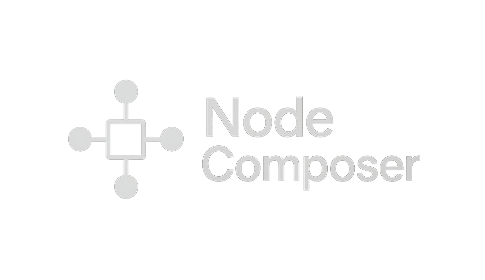

<div align="center">
  
  
  # 🎵 NodeComposer
  
  > **A local, privacy-focused AI music generator capable of learning your unique sonic signature.**
  
     
</div>

## 📖 Overview

**NodeComposer** is a self-hosted alternative to services like Suno or Udio. Unlike cloud based generators, NodeComposer runs entirely on your local machine. It allows you to generate high-fidelity music from text prompts and, most importantly, **fine-tune the model on your own music library** to create a generator that understands your specific style.

### ✨ Key Features

* **100% Local & Private:** No credits, no subscriptions, no data leaving your machine.
* **Custom Model Training:** Fine-tune the underlying MusicGen model on your own `.wav` files to mimic your genre or instrumentals.
* **Suno-like Interface:** A modern, dark-mode web UI built with Next.js for managing generation queues and playback.
* **Text-to-Music & Audio-to-Audio:** Generate from scratch or upload a melody whistle to guide the AI.
* **Stem Separation:** Auto-separate generated tracks into drums, bass, vocals, and other stems using Demucs or Spleeter.
* **Batch Generation:** Generate multiple tracks at once or create variations of a single prompt.
* **Prompt Templates:** Pre-built templates for genres, moods, instruments, and styles with custom template support.
* **Audio Export:** Export tracks in multiple formats (MP3, FLAC, WAV, OGG) with quality control.
* **Audio Analysis:** Analyze generated tracks for tempo, key, energy, danceability, and more.
* **Configuration Management:** Centralized settings for generation, training, and audio processing.

---

## 🏗️ The Tech Stack

NodeComposer uses a hybrid architecture to combine the best AI tools with the best web frameworks.

| Component | Technology | Description |
| :--- | :--- | :--- |
| **AI Model** | **AudioCraft (MusicGen)** | The core transformer model by Meta Research. |
| **Fine-Tuning** | **LoRA / PEFT** | Efficient training technique to learn your music without retraining the whole model. |
| **Backend API** | **FastAPI (Python)** | Exposes the model inference and training status to the UI. |
| **Frontend** | **Next.js (Node.js)** | A reactive UI for prompting, playback, and library management. |
| **Styling** | **Tailwind CSS** | For that sleek, professional audio-app aesthetic. |
| **Database** | **SQLite** | Zero-config local database to store your prompts and generation history. |
| **Stem Separation** | **Demucs / Spleeter** | Source separation for extracting individual stems. |
| **Audio Processing** | **Librosa / FFmpeg** | Audio analysis, conversion, and processing utilities. |

---

## ⚡ Prerequisites

* **OS:** Linux (Ubuntu 22.04 recommended) or Windows 11 (WSL2).
* **GPU:** NVIDIA GPU with at least **12GB VRAM** (RTX 3060 or higher). *24GB recommended for training.*
* **Software:**
    * Python 3.10+
    * Node.js 18+
    * CUDA Toolkit 11.8+
    * FFmpeg (required for audio export and processing)
    * Demucs or Spleeter (optional, for stem separation)

---

## 🚀 Installation

### 1. Clone the Repository
```bash
git clone [https://github.com/makalin/NodeComposer.git](https://github.com/makalin/NodeComposer.git)
cd NodeComposer
````

### 2\. Backend Setup (Python)

This handles the music generation and training logic.

```bash
cd backend
python -m venv venv
source venv/bin/activate  # or venv\Scripts\activate on Windows

# Install PyTorch with CUDA support (Adjust for your CUDA version)
pip install torch torchvision torchaudio --index-url [https://download.pytorch.org/whl/cu118](https://download.pytorch.org/whl/cu118)

# Install dependencies including AudioCraft
pip install -r requirements.txt

# Start the API server
uvicorn main:app --reload --port 8000
```

### 3\. Frontend Setup (Node.js)

This handles the UI and player.

```bash
# In a new terminal window
cd frontend
npm install

# Start the UI
npm run dev
```

Visit `http://localhost:3000` to open NodeComposer.

### 4. Optional: Install Stem Separation Tools

For stem separation features, install either Demucs or Spleeter:

```bash
# Option 1: Demucs (Recommended)
pip install demucs

# Option 2: Spleeter
pip install spleeter
```

**Note:** Stem separation requires additional dependencies and may take time to download models on first use.

-----

## 🎧 Usage Guide

### Generating Music

1.  Navigate to the **Compose** tab.
2.  Enter a prompt: *"A cyber-noir synthwave track with heavy bass and slow tempo."*
   - **Tip:** Use the "Browse Templates" button to access pre-built prompt templates
   - **Tip:** Click "Show Batch Generator" to generate multiple tracks or variations
3.  Set duration (e.g., 30s) and click **Generate**.
4.  The task is queued locally; progress is shown in the sidebar.
5.  Once completed, click **Play** to listen or **Tools** to access advanced features.

### Advanced Features

#### Prompt Templates
- Browse pre-built templates organized by genres, moods, instruments, and styles
- Create and save your own custom templates
- Search templates by keyword
- Combine multiple template elements

#### Batch Generation
- **Multiple Prompts:** Generate multiple tracks from different prompts simultaneously
- **Variations:** Generate multiple variations of a single prompt with different parameters
- **Themed Playlists:** Create cohesive playlists around a theme

#### Audio Tools
- **Export:** Convert tracks to MP3, FLAC, WAV, or OGG formats
- **Stem Separation:** Separate tracks into individual stems (drums, bass, vocals, other)
- **Analysis:** View detailed audio analysis including tempo, key, energy, and danceability

### Training on Your Data (Fine-Tuning)

1.  Place your source audio files (WAV/MP3) in the `dataset/` folder.
2.  Navigate to the **Train** tab.
3.  Click **Process Dataset**. This will slice your audio and auto-caption it (using CLAP).
4.  Adjust training parameters (epochs, learning rate, batch size) if needed.
5.  Click **Start Training**.
      * *Note: Training takes 2-6 hours depending on your GPU and dataset size.*
6.  Once finished, select your new "Node" (Model Checkpoint) in the Compose tab to generate music in your style.

### Library Management

- View all completed generations in the **Library** tab
- Play tracks directly from the library
- Delete unwanted tracks
- Access audio tools for each track

-----

## 🛠️ Advanced Tools & API

### Backend Tools

NodeComposer includes several powerful backend tools:

- **Stem Separator** (`stem_separator.py`): Separate audio into individual stems using Demucs or Spleeter
- **Audio Exporter** (`audio_export.py`): Convert and export audio in multiple formats with quality control
- **Batch Generator** (`batch_generator.py`): Generate multiple tracks efficiently
- **Prompt Templates** (`prompt_templates.py`): Manage and organize prompt templates
- **Audio Analyzer** (`audio_analyzer.py`): Analyze audio for tempo, key, energy, and more
- **Config Manager** (`config_manager.py`): Centralized configuration management

### API Endpoints

#### Generation
- `POST /api/generate` - Generate music from text prompt
- `POST /api/generate/audio` - Generate music with audio conditioning
- `GET /api/tasks` - Get all generation tasks
- `GET /api/tasks/{task_id}` - Get specific task
- `GET /api/tasks/{task_id}/audio` - Stream audio file

#### Batch Operations
- `POST /api/batch/generate` - Generate multiple tracks
- `POST /api/batch/variations` - Generate prompt variations

#### Audio Tools
- `POST /api/tasks/{task_id}/separate` - Separate audio into stems
- `POST /api/tasks/{task_id}/export` - Export audio in different format
- `GET /api/tasks/{task_id}/analyze` - Analyze audio file
- `GET /api/tasks/{task_id}/waveform` - Get waveform data

#### Templates
- `GET /api/prompts/templates` - List all templates
- `GET /api/prompts/templates/{category}/{name}` - Get specific template
- `POST /api/prompts/templates` - Create new template
- `GET /api/prompts/search` - Search templates

#### Training
- `POST /api/train/process-dataset` - Process dataset
- `GET /api/train/status` - Get training status
- `POST /api/train/start` - Start training
- `POST /api/train/stop` - Stop training

#### Configuration
- `GET /api/config` - Get configuration
- `POST /api/config` - Update configuration

Visit `http://localhost:8000/docs` for interactive API documentation.

## 🗺️ Roadmap

  - [x] **Stem Separation:** Auto-separate tracks into drums, bass, vocals, and other stems
  - [x] **Batch Generation:** Generate multiple tracks or variations
  - [x] **Prompt Templates:** Pre-built and custom templates
  - [x] **Audio Export:** Multiple format support
  - [x] **Audio Analysis:** Tempo, key, energy analysis
  - [ ] **In-Painting:** Re-generate specific bad sections of a track
  - [ ] **Lyrics Integration:** Integration with TTS models for vocal generation
  - [ ] **MIDI Export:** Convert generated audio to MIDI for use in DAWs (via Spotify Basic Pitch)
  - [ ] **Real-time Waveform Visualization:** Visual waveform display in frontend
  - [ ] **Cloud Storage Integration:** Export directly to cloud storage

## 📚 Additional Documentation

- **[FEATURES.md](FEATURES.md)** - Detailed documentation of all tools and features
- **[Backend README](backend/README.md)** - Backend-specific setup and API documentation
- **[Frontend README](frontend/README.md)** - Frontend setup and development guide

## 🔧 Configuration

NodeComposer uses a JSON-based configuration system. Configuration files are automatically created:

- `backend/config.json` - Backend configuration
- `backend/prompt_templates.json` - Prompt templates database

You can manage configuration via the API or by editing these files directly.

## 🐛 Troubleshooting

### GPU Not Detected
- Ensure CUDA is properly installed and PyTorch can detect your GPU
- Check with: `python -c "import torch; print(torch.cuda.is_available())"`

### Stem Separation Not Working
- Ensure Demucs or Spleeter is installed: `pip install demucs` or `pip install spleeter`
- First run will download models (may take several minutes)

### Audio Export Fails
- Ensure FFmpeg is installed and accessible in PATH
- Check installation: `ffmpeg -version`

### Frontend Can't Connect to Backend
- Ensure backend is running on port 8000
- Check `NEXT_PUBLIC_API_URL` in frontend `.env.local` file
- Verify CORS settings in `backend/main.py`

## 🤝 Contributing

Pull requests are welcome. For major changes, please open an issue first to discuss what you would like to change.

### Development Setup

1. Fork the repository
2. Create a feature branch: `git checkout -b feature/amazing-feature`
3. Make your changes
4. Test thoroughly
5. Commit your changes: `git commit -m 'Add amazing feature'`
6. Push to the branch: `git push origin feature/amazing-feature`
7. Open a Pull Request

## 📄 License

[MIT](https://choosealicense.com/licenses/mit/)

## 🙏 Acknowledgments

- **Meta AudioCraft** - MusicGen model
- **Demucs** - Source separation
- **Spleeter** - Alternative source separation
- **Librosa** - Audio analysis
- **FastAPI** - Modern Python web framework
- **Next.js** - React framework
